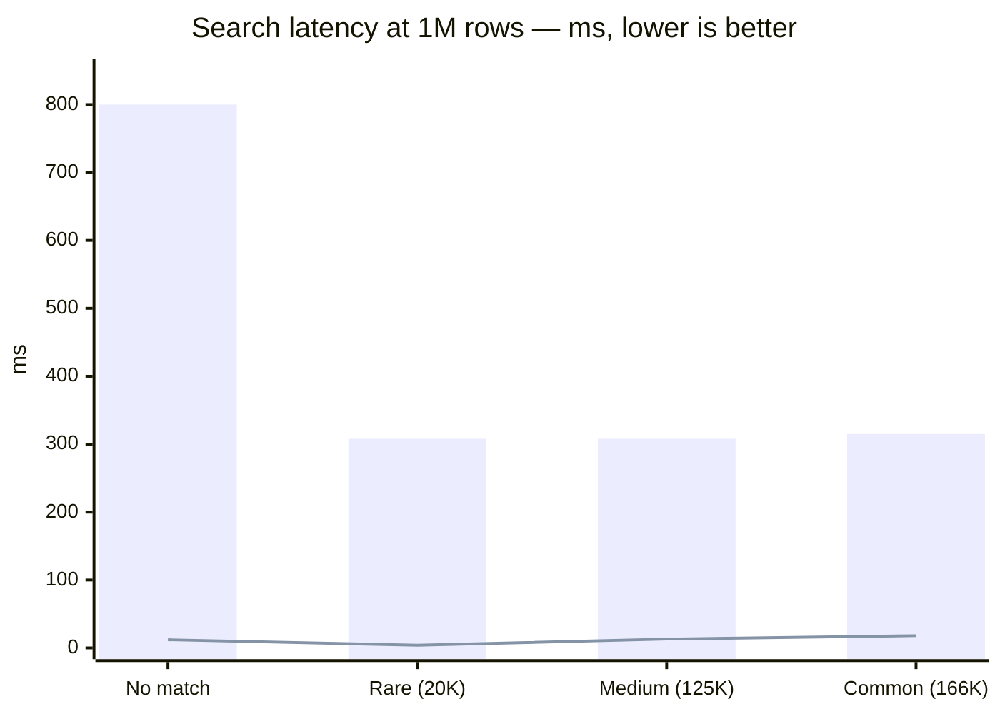
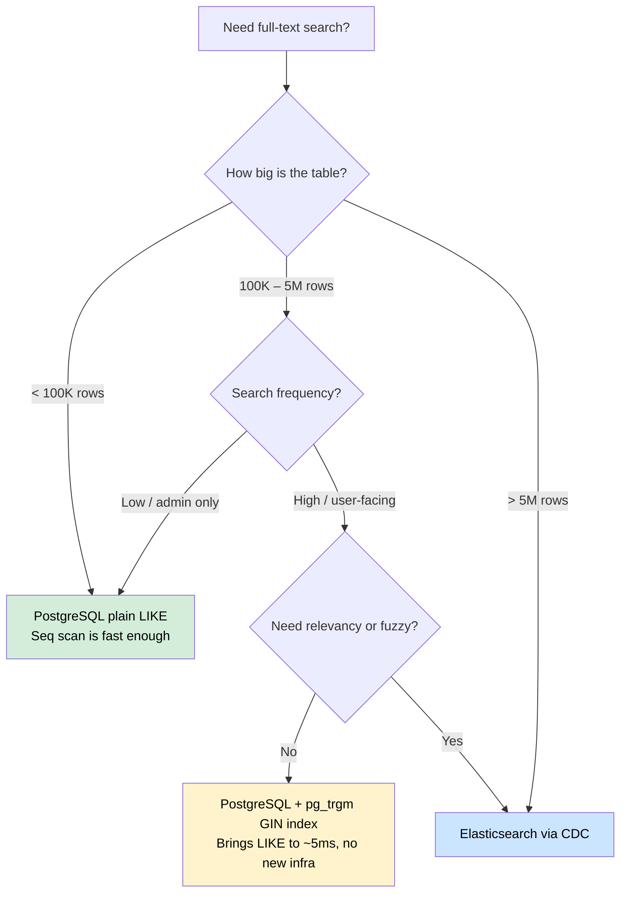

# CDC POC: Debezium → Kafka → Elasticsearch

A production-pattern Change Data Capture (CDC) proof-of-concept. PostgreSQL is the source of truth for all writes. Debezium tails the Write-Ahead Log and publishes every row change to Kafka — no dual-write code, no triggers, no scheduled sync jobs. A Spring Boot consumer batch-indexes those events into Elasticsearch.

## Architecture

```
┌─────────────────────────────────────────────────────────────────────┐
│  WRITE PATH                                                         │
│                                                                     │
│  POST /api/tickets                                                  │
│       │                                                             │
│       ▼                                                             │
│  Spring Boot ──JPA/JDBC──► PostgreSQL  (wal_level=logical)         │
│                                  │                                  │
│                             WAL stream (pgoutput plugin)            │
│                                  │                                  │
│                                  ▼                                  │
│                        Debezium (Kafka Connect)                     │
│                                  │                                  │
│                   Kafka topic: dbserver1.public.tickets             │
│                                  │                                  │
│                    Spring Boot Kafka consumer                       │
│                    (batch: up to 500 records / poll)                │
│                                  │                                  │
│                       searchRepository.saveAll()                    │
│                                  │                                  │
│                          Elasticsearch                              │
│                                                                     │
├─────────────────────────────────────────────────────────────────────┤
│  READ PATH                                                          │
│                                                                     │
│  GET /search/elastic?q=... ──► Elasticsearch (inverted index)      │
│  GET /search/postgres?q=... ─► PostgreSQL    (LIKE sequential scan) │
└─────────────────────────────────────────────────────────────────────┘
```

### Key design decisions

| Decision | Rationale |
|---|---|
| Debezium reads **WAL** directly | Zero overhead on writes — no triggers, no dual-write code, no polling |
| Kafka listener in **batch mode** (500 records/poll) | One `saveAll()` = one ES HTTP request — ~100× faster for the initial snapshot of 1M rows |
| `english` analyzer on title + description | Stemming ("databases" → "databas"), stopword removal, lowercase folding — all free at index time |
| `Keyword` type for status / priority / assignee | Exact-match filtering and aggregations with no re-analysis overhead |
| Dual Kafka listener config | `localhost:9092` for Spring Boot (host network); `kafka:29092` for Debezium (container-to-container) |

## Infrastructure

| Container | Image | Port | Role |
|---|---|---|---|
| `cdc-postgres` | `postgres:15` | 5434 | Source of truth; WAL replication enabled |
| `cdc-zookeeper` | `confluentinc/cp-zookeeper:7.5.0` | 2181 | Kafka coordinator |
| `cdc-kafka` | `confluentinc/cp-kafka:7.5.0` | 9092 | Change event stream |
| `cdc-connect` | `debezium/connect:2.5` | 8083 | Debezium: WAL → Kafka |
| `cdc-elasticsearch` | `elasticsearch:8.11.0` | 9200 | Full-text search index |
| Spring Boot 3.2 | local build | 8081 | Write API + CDC consumer + Search API |

## Benchmark Results

Measured live against 1,000,001 tickets. Hit counts were verified to be **identical** in both engines before recording timing.

The PostgreSQL endpoint runs two queries per request: `SELECT … LIMIT 10` (finds first 10 results) + `COUNT(*)` (full table scan for total hits). The timing shown is the combined wall time of both.

### Search latency — ES (`fuzziness:AUTO`) vs PostgreSQL LIKE

All timings are averages of 5 warm-cache runs.

| Scenario | Query | Hits (PG = ES) | Elasticsearch | PostgreSQL | Speedup |
|---|---|---|---|---|---|
| **No match** | `xyznotfound` | 0 | ~12 ms | **~800 ms** | **65×** |
| **Low frequency** (2% of rows) | `user47` | 20,000 | ~165 ms † | **~308 ms** | 1.9× |
| **Medium frequency** (12.5%) | `auth` | 125,000 | ~13 ms | **~308 ms** | **24×** |
| **High frequency** (16.6%) | `timeout` | 166,666 | ~18 ms | **~315 ms** | **17×** |

† `fuzziness:AUTO` generates edit-distance-2 candidates for 6-char terms like `user47`, causing ~165ms. Without fuzziness the same query returns in ~4ms (77× speedup). See [Fuzziness note](#fuzziness-note) below.

### Why the "no match" case is the worst for PostgreSQL

When a query matches zero rows, **both** the `SELECT LIMIT 10` and the `COUNT(*)` must scan all 1M rows — neither can exit early. That doubles the scan cost (~800ms vs ~310ms for a matching query). Elasticsearch consults the inverted index regardless and returns immediately (~12ms).

### Fuzziness note

`fuzziness:AUTO` in Elasticsearch calculates edit distance by term length:
- 1–2 chars → no fuzziness
- 3–5 chars → edit distance 1
- 6+ chars → **edit distance 2**

A 6-character term like `user47` with edit distance 2 causes ES to enumerate many candidate tokens in the BK-tree automaton (e.g., `user46`, `user48`, `user37`, ...). For typo-tolerant user-facing search this is desirable. For structured fields like user IDs, either disable fuzziness or use a `keyword` field with exact-match queries.

### PostgreSQL query plan (COUNT on 1M rows)

```
Parallel Seq Scan on tickets
  Filter: description LIKE '%timeout%' OR title LIKE '%timeout%'
  Buffers: shared hit=13518, read=14791     ← 14,791 disk block reads
  Execution Time: 275 ms  (warm buffer cache)
```

The planner uses a parallel sequential scan — it scans every page regardless of how many rows match. With cold disk I/O, the 14,791 disk block reads would push this into the seconds range.

### CDC propagation latency

```
POST /api/tickets  →  PostgreSQL write  →  WAL  →  Debezium  →  Kafka  →  consumer  →  Elasticsearch
```

In testing, a newly created ticket appeared as the **top-ranked result** in Elasticsearch within **~3 seconds**.

### Sync status at test time

```json
{
  "postgresql":    1000001,
  "elasticsearch": 1000001,
  "lag":           0,
  "syncPercent":   "100.0%"
}
```

### Elasticsearch index stats

| Metric | Value |
|---|---|
| Documents | 1,000,001 |
| Primary shard size | ~99 MB |

## PostgreSQL vs Elasticsearch — When to Use Which

### Latency at 1M rows (this benchmark)



*Bar = PostgreSQL LIKE + COUNT. Line = Elasticsearch.*

---

### Decision flowchart



**Rule of thumb:** exhaust the simpler options first.
`WHERE + index` → `pg_trgm` → `Elasticsearch`

---

### Pros and cons

#### PostgreSQL (plain LIKE)

| | |
|---|---|
| ✅ **Strong consistency** | Search results always reflect the latest committed write — no lag |
| ✅ **Zero infra overhead** | No Kafka, no Debezium, no separate index to operate |
| ✅ **ACID on search** | Reads participate in transactions; perfect for financial or audit queries |
| ✅ **Simple reasoning** | One datastore, one source of truth, no sync bugs |
| ❌ **Sequential scan** | `LIKE '%term%'` forces a full table scan — latency grows linearly with rows |
| ❌ **No relevancy** | Results are unranked — first row found, not best match |
| ❌ **No fuzzy matching** | `databse` will not match `database` |
| ❌ **Concurrent searches hurt writes** | Heavy read scans compete for I/O with your write path |

#### PostgreSQL + `pg_trgm` GIN index (middle path)

```sql
CREATE EXTENSION pg_trgm;
CREATE INDEX ON tickets USING GIN (description gin_trgm_ops);
```

| | |
|---|---|
| ✅ **Fast LIKE on large tables** | Brings `%pattern%` from ~300ms to ~5ms on 1M rows |
| ✅ **No new infrastructure** | Still one datastore, strong consistency |
| ✅ **Handles similarity queries** | `similarity()` and `%` operator for fuzzy-ish matching |
| ❌ **No relevancy scoring** | Still no "best match first" ranking |
| ❌ **Index bloat** | GIN indexes are large and slow to build on existing data |
| ❌ **Limited multi-field boost** | Can't weight title matches higher than description matches |

#### Elasticsearch via CDC

| | |
|---|---|
| ✅ **Relevancy scoring** | TF-IDF + BM25 — results ranked by how well they match, not row order |
| ✅ **Fuzzy matching** | `fuzziness:AUTO` handles typos out of the box |
| ✅ **Multi-field boost** | Title matches can be weighted 2× description matches |
| ✅ **Consistent sub-50ms** | Inverted index lookup doesn't degrade with dataset size |
| ✅ **Scales independently** | Search load doesn't compete with write I/O on the primary DB |
| ✅ **Aggregations** | Fast `GROUP BY`-style analytics on large text datasets |
| ❌ **Eventual consistency** | CDC lag of ~1-5s — a write is not immediately searchable |
| ❌ **Operational complexity** | Kafka + Debezium + ES to deploy, monitor, and tune |
| ❌ **Sync bugs** | Index can drift from DB if the consumer falls behind or a message is lost |
| ❌ **Cost** | Memory-heavy stack — this POC uses ~6GB RAM just for infrastructure |
| ❌ **Fuzziness on IDs** | `fuzziness:AUTO` on 6+ char terms (e.g. `user47`) is slow — use exact `keyword` fields for structured IDs |

---

### Summary table

| | PG LIKE | PG + pg_trgm | Elasticsearch |
|---|---|---|---|
| Setup complexity | none | low | high |
| Latency at 1M rows | 300–800ms | ~5ms | ~5–20ms |
| Relevancy scoring | no | no | yes |
| Fuzzy / typo tolerance | no | partial | yes |
| Consistency | strong | strong | eventual (~1-5s lag) |
| Good for | small tables, admin queries | medium tables, exact search | large tables, user-facing search |

## Running the Stack

### Prerequisites

- Docker + Docker Compose
- Java 21, Maven 3.x

### 1. Start infrastructure

```bash
docker compose up -d
```

### 2. Register the Debezium connector

```bash
cd scripts && ./register-connector.sh
```

### 3. Build and start Spring Boot

```bash
mvn package -DskipTests
java -jar target/cdc-poc-0.0.1-SNAPSHOT.jar
```

### 4. Seed 1M tickets (async — returns immediately)

```bash
curl -X POST "http://localhost:8081/api/tickets/generate?count=1000000"
```

### 5. Watch sync progress

```bash
watch -n2 'curl -s http://localhost:8081/api/tickets/sync-status'
```

## API Reference

| Method | Endpoint | Description |
|---|---|---|
| `POST` | `/api/tickets` | Create one ticket |
| `POST` | `/api/tickets/generate?count=N` | Bulk-generate N tickets via JDBC batch (async) |
| `GET` | `/api/tickets/search/elastic?q=` | Full-text search — Elasticsearch |
| `GET` | `/api/tickets/search/postgres?q=` | Sequential LIKE scan — PostgreSQL |
| `GET` | `/api/tickets/sync-status` | CDC lag: PG count vs ES count |

### Example requests

```bash
# Create a ticket
curl -X POST http://localhost:8081/api/tickets \
  -H "Content-Type: application/json" \
  -d '{"title":"Deadlock in payment service","description":"Critical deadlock under peak load","priority":"CRITICAL","assignee":"oncall@company.com"}'

# Search Elasticsearch (fast path)
curl "http://localhost:8081/api/tickets/search/elastic?q=database+timeout"

# Search PostgreSQL (slow path — for comparison)
curl "http://localhost:8081/api/tickets/search/postgres?q=database+timeout"

# Check CDC lag
curl http://localhost:8081/api/tickets/sync-status
```

## How CDC Works (Step by Step)

1. **PostgreSQL WAL** — every committed INSERT/UPDATE/DELETE is written to the Write-Ahead Log. With `wal_level=logical`, the WAL includes full before/after row payloads.

2. **Debezium** — runs as a Kafka Connect plugin. It creates a replication slot (`debezium_poc_slot`) and a publication (`dbz_publication`) on the `tickets` table, then tails the WAL and emits one Kafka message per row change. The `op` field is `c` (create), `u` (update), `r` (snapshot read), or `d` (delete).

3. **Kafka topic** — `dbserver1.public.tickets` holds the ordered change log and retains messages until the consumer commits offsets.

4. **Spring Boot consumer** — `@KafkaListener` in batch mode receives up to 500 records per poll, builds a `List<TicketDocument>`, and calls `searchRepository.saveAll()` — one bulk HTTP call to Elasticsearch per batch.

5. **Elasticsearch** — indexes documents using the `english` analyzer on text fields. The `multi_match` query searches `title` (2× boost) + `description` with optional `fuzziness:AUTO`.
